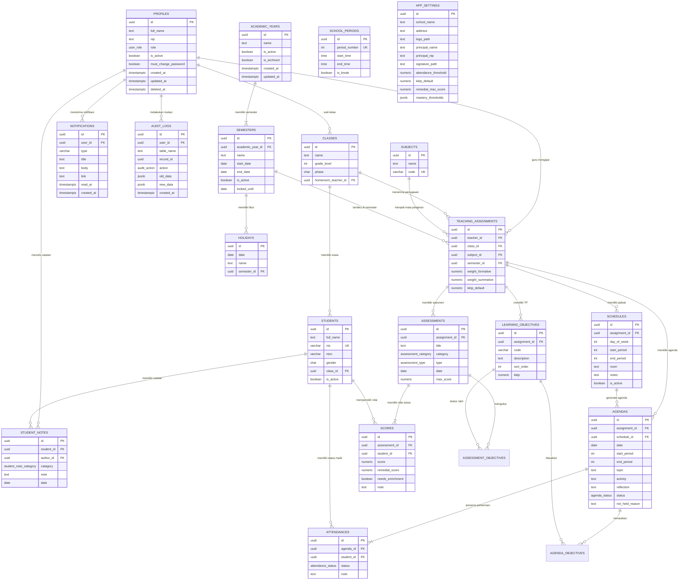

# Diagram Entitas Relasi Database (ERD) - Ruang Guru

Berikut adalah diagram Entity-Relationship Diagram (ERD) lengkap yang menggambarkan model data sistem **Ruang Guru (Buku Guru Digital)**.

```mermaid
erDiagram
    PROFILES ||--o{ TEACHING_ASSIGNMENTS : "guru mengajar"
    PROFILES ||--o{ CLASSES : "wali kelas"
    PROFILES ||--o{ NOTIFICATIONS : "menerima notifikasi"
    PROFILES ||--o{ AUDIT_LOGS : "melakukan mutasi"
    PROFILES ||--o{ STUDENT_NOTES : "menulis catatan"

    ACADEMIC_YEARS ||--|{ SEMESTERS : "memiliki semester"
    
    CLASSES ||--o{ STUDENTS : "memiliki siswa"
    CLASSES ||--o{ TEACHING_ASSIGNMENTS : "menerima penugasan"
    
    SUBJECTS ||--o{ TEACHING_ASSIGNMENTS : "menjadi mata pelajaran"
    
    SEMESTERS ||--o{ TEACHING_ASSIGNMENTS : "berlaku di semester"
    SEMESTERS ||--o{ HOLIDAYS : "memiliki libur"

    TEACHING_ASSIGNMENTS ||--o{ SCHEDULES : "memiliki jadwal"
    TEACHING_ASSIGNMENTS ||--o{ LEARNING_OBJECTIVES : "memiliki TP"
    TEACHING_ASSIGNMENTS ||--o{ AGENDAS : "memiliki agenda"
    TEACHING_ASSIGNMENTS ||--o{ ASSESSMENTS : "memiliki asesmen"

    SCHEDULES ||--o{ AGENDAS : "generate agenda"

    AGENDAS ||--|{ ATTENDANCES : "presensi pertemuan"
    AGENDAS ||--o{ AGENDA_OBJECTIVES : "menautkan"
    LEARNING_OBJECTIVES ||--o{ AGENDA_OBJECTIVES : "ditautkan"

    ASSESSMENTS ||--|{ SCORES : "memiliki nilai siswa"
    ASSESSMENTS ||--o{ ASSESSMENT_OBJECTIVES : "mengukur"
    LEARNING_OBJECTIVES ||--o{ ASSESSMENT_OBJECTIVES : "diukur oleh"

    STUDENTS ||--o{ ATTENDANCES : "memiliki status hadir"
    STUDENTS ||--o{ SCORES : "memperoleh nilai"
    STUDENTS ||--o{ STUDENT_NOTES : "memiliki catatan"

    PROFILES {
        uuid id PK
        text full_name
        text nip
        user_role role
        boolean is_active
        boolean must_change_password
        timestamptz created_at
        timestamptz updated_at
        timestamptz deleted_at
    }

    ACADEMIC_YEARS {
        uuid id PK
        text name
        boolean is_active
        boolean is_archived
        timestamptz created_at
        timestamptz updated_at
    }

    SEMESTERS {
        uuid id PK
        uuid academic_year_id FK
        text name
        date start_date
        date end_date
        boolean is_active
        date locked_until
    }

    CLASSES {
        uuid id PK
        text name
        int grade_level
        char phase
        uuid homeroom_teacher_id FK
    }

    STUDENTS {
        uuid id PK
        text full_name
        varchar nis UK
        varchar nisn
        char gender
        uuid class_id FK
        boolean is_active
    }

    SUBJECTS {
        uuid id PK
        text name
        varchar code UK
    }

    SCHOOL_PERIODS {
        uuid id PK
        int period_number UK
        time start_time
        time end_time
        boolean is_break
    }

    HOLIDAYS {
        uuid id PK
        date date
        text name
        uuid semester_id FK
    }

    TEACHING_ASSIGNMENTS {
        uuid id PK
        uuid teacher_id FK
        uuid class_id FK
        uuid subject_id FK
        uuid semester_id FK
        numeric weight_formative
        numeric weight_summative
        numeric kktp_default
    }

    SCHEDULES {
        uuid id PK
        uuid assignment_id FK
        int day_of_week
        int start_period
        int end_period
        text room
        text notes
        boolean is_active
    }

    LEARNING_OBJECTIVES {
        uuid id PK
        uuid assignment_id FK
        varchar code
        text description
        int sort_order
        numeric kktp
    }

    AGENDAS {
        uuid id PK
        uuid assignment_id FK
        uuid schedule_id FK
        date date
        int start_period
        int end_period
        text topic
        text activity
        text reflection
        agenda_status status
        text not_held_reason
    }

    ATTENDANCES {
        uuid id PK
        uuid agenda_id FK
        uuid student_id FK
        attendance_status status
        text note
    }

    ASSESSMENTS {
        uuid id PK
        uuid assignment_id FK
        text title
        assessment_category category
        assessment_type type
        date date
        numeric max_score
    }

    SCORES {
        uuid id PK
        uuid assessment_id FK
        uuid student_id FK
        numeric score
        numeric remedial_score
        boolean needs_enrichment
        text note
    }

    STUDENT_NOTES {
        uuid id PK
        uuid student_id FK
        uuid author_id FK
        student_note_category category
        text note
        date date
    }

    NOTIFICATIONS {
        uuid id PK
        uuid user_id FK
        varchar type
        text title
        text body
        text link
        timestamptz read_at
        timestamptz created_at
    }

    APP_SETTINGS {
        uuid id PK
        text school_name
        text address
        text logo_path
        text principal_name
        text principal_nip
        text signature_path
        numeric attendance_threshold
        numeric kktp_default
        numeric remedial_max_score
        jsonb mastery_thresholds
    }

    AUDIT_LOGS {
        uuid id PK
        uuid user_id FK
        text table_name
        uuid record_id
        audit_action action
        jsonb old_data
        jsonb new_data
        timestamptz created_at
    }
```

